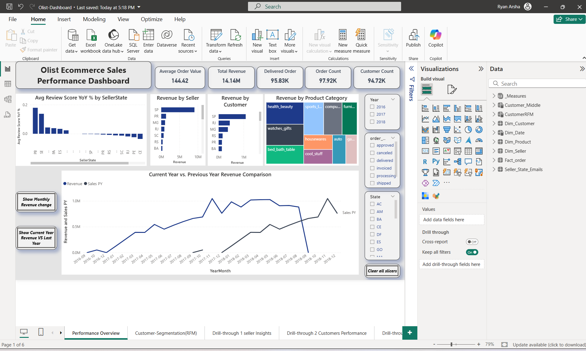
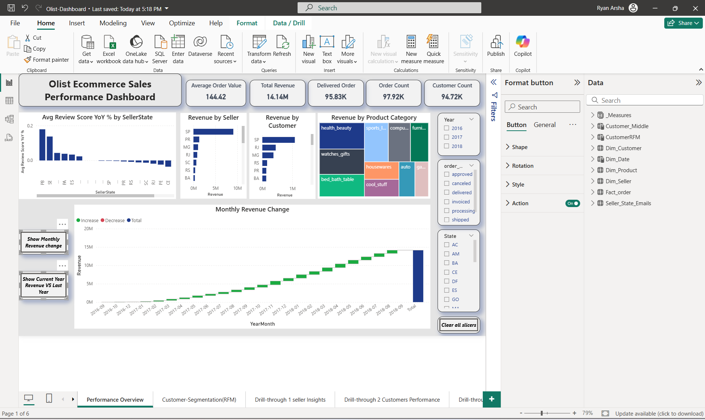
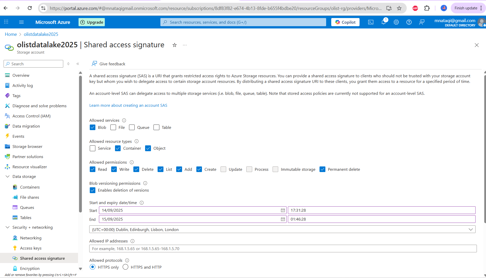
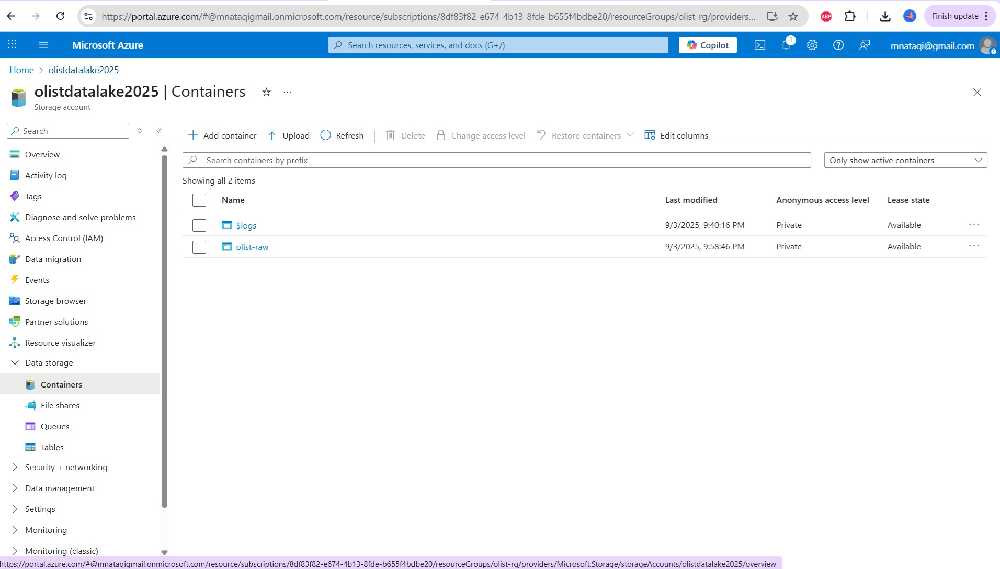
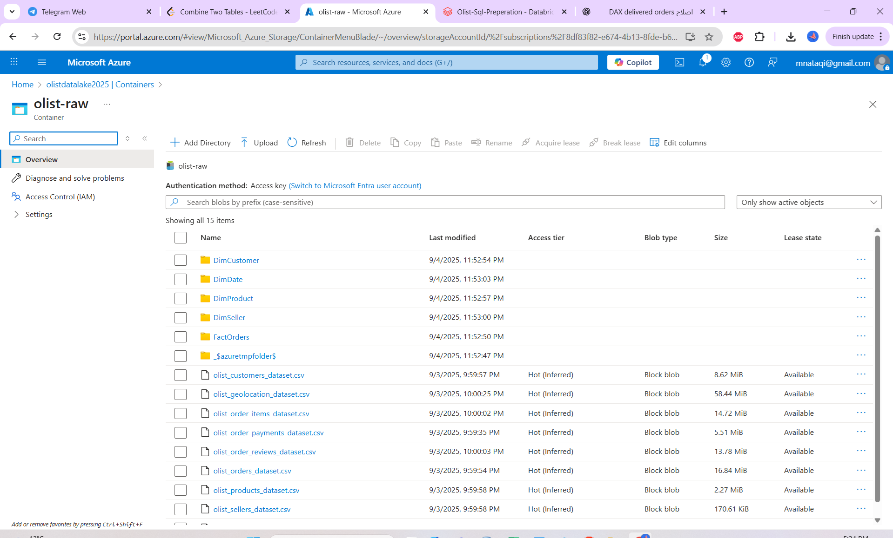

## Demo


# Olist Ecommerce Analytics — Azure Databricks + Power BI

**End-to-end retail analytics on the public Olist dataset.**  
Ingest & model in **Azure Databricks**, store curated data in **Azure Blob (SAS)**, and deliver insights with **Power BI** (KPI, **RFM segmentation**, drill-through).

> ⚠️ All secrets are **redacted**. Replace placeholders with your own credentials (Databricks **Secret Scope** or environment variables).

---

## TL;DR

- ⭐ **Business:** growth levers via **RFM cohorts**, top sellers/customers/categories, YoY trends.  
- 🛠️ **Tech:** Notebooks → **star schema** → PBIX; fast visuals; RLS sanity page.  
- ⏱️ **60-sec demo:** open `powerbi/Olist-Dashboard.pbix`, point to `data/*/*.csv`, **Refresh**.


---


### Dashboards (screenshots)

<p align="center">
  
  
</p>

<p align="center">
  
  
</p>

<p align="center">
  
  
</p>

<p align="center">
  
  
</p>


## Repository structure

├─ databricks/
│ ├─ notebooks/
│ │ ├─ etl_olist.py # exported & sanitized notebook
│ │ └─ sql/ # (optional) SQL exports
│ └─ README.md # how to import/run in Databricks
├─ data/ # optional local star-schema CSVs
│ ├─ FactOrders/FactOrders.csv
│ ├─ DimCustomer/DimCustomer.csv
│ ├─ DimProduct/DimProduct.csv
│ ├─ DimSeller/DimSeller.csv
│ └─ DimDate/DimDate.csv
├─ powerbi/
│ └─ Olist-Dashboard.pbix
├─ assets/
│ ├─ azure/ # redacted infra screenshots
│ ├─ databricks/ # notebook screenshots
│ └─ dashboards/ # page screenshots
└─ docs/ # deep dives (engineering, model, RFM…)


---

## Architecture

**Raw (Blob/SAS) → Curated (Star schema in Databricks) → BI (Power BI)**  


---

## Quickstart

### Option A — Local (no Azure needed)

1. Clone this repo.  
2. Open **`powerbi/Olist-Dashboard.pbix`**.  
3. If prompted, browse to `data/*/*.csv` and **Refresh**.

### Option B — Full pipeline (Azure)

1. Create an Azure Storage Account & container `olist-raw` (HTTPS-only SAS).  
2. Import `databricks/notebooks/etl_olist.py` into Databricks.  
3. Store your SAS in a **Secret Scope** and run the notebook to export the star schema back to Blob.  
4. Open the PBIX and connect to those CSVs (Blob or local copy).

## Azure proofs (redacted)

<p align="center">
  
  
</p>

<p align="center">
  
</p>


** Data Source:** Public Olist e-commerce dataset (Brazil).  
This repo includes the curated **star-schema CSVs** (FactOrders, DimCustomer, DimProduct, DimSeller, DimDate) for local demo.  
Please check the original dataset license for re-use and attribution guidelines.


Example (sanitized):

```python
# NOTE: the real token is stored in a Secret Scope in Databricks.
# sas_token = dbutils.secrets.get(scope="olist-secrets", key="adls-sas")
sas_token = "<SAS_AT_RUNTIME>"
account   = "olistdatalake2025"
container = "olist-raw"

spark.conf.set(
    f"fs.azure.sas.{container}.{account}.blob.core.windows.net",
    sas_token
)


